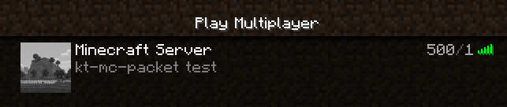
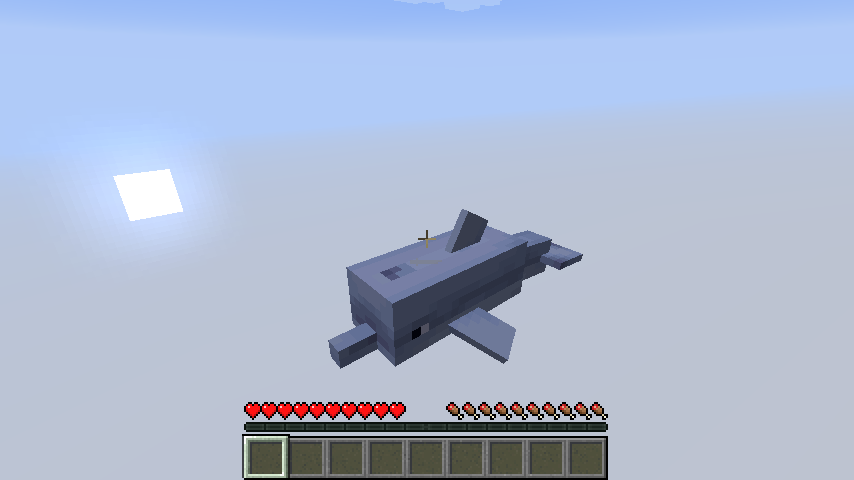

# kt-mc-packet

A Minecraft Java Edition Protocol library for Kotlin multiplatform that uses Kotlinx.serialization 
to Encode and Decode Minecraft packets as kotlin data classes.

## Usage

Serialize:
```kotlin
val minecraftVersion = 578 // 1.15.2

val byteArray: ByteArray = MinecraftProtocol.dump(
    Handshake.serializer(),
    Handshake(
        minecraftVersion,
        "minecraftserver.com",
        25565,
        HandshakePacket.HandshakeNextState.STATUS
    )
)
```

Deserialize:
```kotlin
val handshake: Handshake = MinecraftProtocol.load(
    Handshake.serializer(),
    byteArrayWithPacketData
)
```

## Images

from `src/jvmTest/kotlin/ServerStatusTest.kt`


from `src/jvmTest/kotlin/ServerLoginTest.kt`
